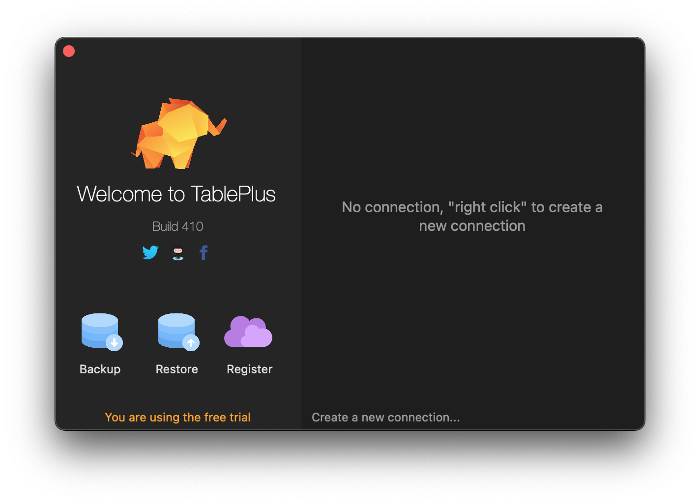
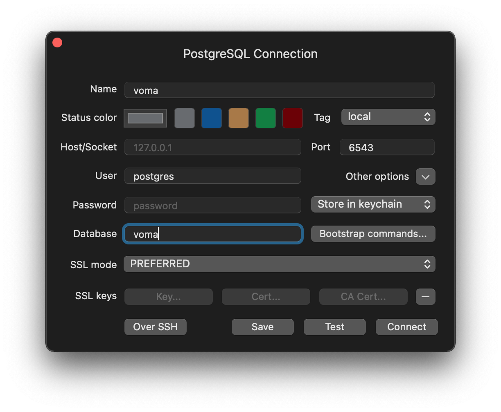

# [Front End] Voma is Code for Chicago's custom **vo**lunteer **ma**nagement system.

[](https://app.netlify.com/sites/voma/deploys)

[https://voma.netlify.app/](https://voma.netlify.app/)

## What is Voma?

At a high level we're trying to achieve the following:

1. Facilitate a smooth process from attending onboarding night to setting up a 1x1 with a project lead
2. Better identify and develop our volunteer's skillsets - where do our skills currently align and where do we want them to go?
3. Integrate with our existing tools (Meetup, Slack, Trello, etc.)
4. Better visualize the scope of our members through skill dashboards and other visualizations
5. Automate whenever possible to reduce bottlenecks in onboarding

This project was bootstrapped with [Create React App](https://github.com/facebook/create-react-app).

### Tech Stack

React<br />
Node / Express<br />
PostgreSQL

### Planned Integrations

Slack<br />
Meetup<br />
Trello

### Scope of MVP

1. New Member completes onboarding form (modeled after current Google Form)
2. System generates user profile based on input
3. Project Leads review new volunteers and set up 1x1s / assign to projects

## Repositories

[Front End](https://github.com/Code-For-Chicago/Voma-frontend)<br />

## How to Contribute Guide
[How to Contribute to Voma](How-to-Contribute.md)

## 🔧 Requirements

```
node >=14.17.0
npm >=6.14.13
```

You can use a tool like [nvm](https://github.com/nvm-sh/nvm) to get the version of Node that you need

## 🚀 (Frontend) Setup

1. Clone the project with `git clone git@github.com:Code-For-Chicago/Voma-frontend.git`
2. In the `meta-development` slack channel, request the .env file. Once you receive it, add it to the top-level directory of the app. 
3. Install dependencies with `npm i`
4. Start the Express server with `npm run start`
5. Open a new terminal window or tab
6. Move into the `client` directory with `cd client`
7. Install those dependencies with `npm i`
8. Start the React server with `npm run start`

## (Backend) Setup
If you're going to be doing just frontend work you can skip this section. There are two options for getting a local database running for development. 

**(Option A)** is a straight forward Docker / Docker Compose configuration that sets up a [pgAdmin](https://www.pgadmin.org/) interface to interact with the database visually.

**(Option B)** also uses Docker but simplifies the box configuration using [Lando](https://lando.dev/). You'll need to install a database GUI client program to view the database instead of pgAdmin. Directions here go over setting up [TablePlus](https://www.tableplus.io/download) but you can use the connection settings to connect to any database client that supports Postgres. 

---

### (Option A) - Docker / Docker Compose with pgAdmin
1. The first thing you'll need to do is install the service on your machine. These [installation instructions](https://docs.docker.com/engine/install/) over at the docker docs site are handy for this part. 
  - If you're using Windows I highly advise setting up Windows Subsystem for Linux using version 2 or greater. Doing this will make it so our makefile works in your environment and overall just makes it easier to interact with Docker. Luckily, Docker has also provided a [guide for getting this setup](https://docs.docker.com/docker-for-windows/wsl/).
2. Next, pull the Docker official image for Postgres from the docker hub repository by running the following in your command line: 
`docker pull postgres`
  - You can find the documentation of the [image here](https://github.com/docker-library/docs/blob/master/postgres/README.md)
3. Run the database container using Docker, or Docker Compose.
  * **Docker**: After it finishes pulling, enter the following in your command line:
`docker run -d  -p 5432:5432 -e POSTGRES_PASSWORD=password --name postgres-dev postgres`
    - You can set `POSTGRES_PASSWORD` to whatever you want, just make sure you remember it!
    - You don't need to specify the `--name` either. If you omit this, docker will randomly assign you one.
  * **Docker Compose**: navigate to the /docker-compose/ directory. Verify the postgres username and password in the file here, or modify if desired. Run the command `docker-compose up` to launch the containers for postgres and adminer (database admin tool) [source](https://hub.docker.com/_/postgres). To run containers in the background (do not show live logs in the terminal window), use the `-d` flag; to stop containers running in the background use the command `docker-compose down`.
4. Open up docker and click on the **Containers/Apps** tab. You should something running.
5. Next, we'll pull a **pgAdmin** image. pgAdmin is a an administration and development tool for Postgres. Enter the follwowing in your command line:
`docker pull dpage/pgadmin4`
6. After it finishes pulling, run the image instance with the following command:
        docker run \ 
            -p 80:80 \
            -e 'PGADMIN_DEFAULT_EMAIL=email' \
            -e 'PGADMIN_DEFAULT_PASSWORD=password' \
            --name dev-pgadmin \ 
            -d dpage/pgadmin4
    - Enter your email and your own password for the two environment variables. 
    - Feel free to name it something other than dev-pgadmin.
7. Now we need to grab the host address of our DB server. Enter the following in your command line: 
`docker inspect postgres-dev -f "{{json .NetworkSettings.Networks }}"`. 
It should return a JSON object - look for the `IPAddress` field, and note that value. 
  - Make sure to replace `postgres-dev` with whatever you named your db server in step 3. 
7. Go back to docker. You should see a new instance running. Go to http://localhost:80 in your browser. You will see a pgAdmin login prompt. Enter the credentials you defined in step 6, and you should be able to log in. 
8. Click Add a New Server (or right-click the Servers folder in the left pane and select Create -> Server). In the **General** tab, add a name, something like `dev-server`. On the **Connection** tab, add the IP address you got in step 7 in the **host** field, and enter the username and password you created in step 3. If you didn't specify a username, the default value is `postgres`. It should be able to connect to database. 
9. Create a file named `.env.local` at the root of `voma-frontend`. Enter the following values: 
    DB_NAME='postgres'
    DB_USER='postgres'
    DB_PASSWORD='password'
    DB_HOST='localhost'
  - Make sure to replace 'password' with whatever you set in step 3. 
  - If you specified a different username in step 3, enter that value for `DB_USER`. 
10. Enter the following in your command line: 
`cd db && npx sequelize db:migrate`
11. If you see a message listing all the migrations, you're golden!
  - If you get an SSL error when trying to start the app, you can comment out lines 8-12 in `db/index.js`. 

---

### (Option B) - Docker via Lando and TablePlus
#### *Install all the things.*
1. Install [Docker](https://docs.docker.com/engine/install/). 
  - *If you're using Windows try setting up [Windows Subsystem for Linux](https://docs.microsoft.com/en-us/windows/wsl/install) using version 2 or greater. Doing this will make it so our makefile works in your environment and makes it easier to interact with Docker. Luckily, Docker has also provided a [guide for getting this setup](https://docs.docker.com/docker-for-windows/wsl/).*

2. Install [Lando](https://docs.lando.dev/getting-started/installation.html) on your machine.
3. Install [TablePlus](https://www.tableplus.io/download) or your database client of choice, there is a [list on the Postgres wiki of compatible clients](https://wiki.postgresql.org/wiki/PostgreSQL_Clients). 
  - *Note: If you've previously attempted *Option A* - Before you start the installation steps open Docker and manually stop all your boxes, then restart Docker.*
<br /><br />

#### *Setup the box and database.*
These directions assume Windows users are using the WSL or a [Bash simulator](https://www.howtogeek.com/howto/41382/how-to-use-linux-commands-in-windows-with-cygwin/) to run the bash scripts. If you can't use either reach out over Slack for help or an alternative.
1. Run `lando start` in the terminal from the repository root. Lando will create a box with Postgres configured. Once it's complete Lando will list out some vitals about your box including Name, Location, and Services. You can find a [list of Lando commands here](https://docs.lando.dev/cli/), but you only need to remember 4 for basic usage.

Command | Description
---|---
lando start | Starts the Docker box or builds and starts the box if not yet created.
lando stop | Shuts the box down.
lando restart | Restarts box.
lando destroy | Deletes the box from Docker.


  - *Note: If you run into an error here destroy the box with `lando destroy` and try to start the box again.*
2. If you haven't already run `npm install` in the project root, do that now.
3. Run `bash .lando.database.sh` in the terminal from the repository root. This script checks for a `.env.local` file in the repository root. If it doesn't exist it creates it and adds the database credentials *if they're not currently set*. It'll also run the sync script finishing the setup.
  - *Note: If you get an SSL error when trying to start the app comment out lines 8-12 in `db/index.js` and try this step again.*
  - *Note: If you have a `.env.local` with the database variables set (DB_USER, DB_PASSWORD, etc.) update their values manually using the configuration settings in the table. 
<br /><br />

#### *Database Configuration Settings*
Use these configuration settings to configure your custom client or follow the directions below to setup TablePlus.

Configuration Setting | Value
---|---
Username | postgres
Database Name | voma
Host | 127.0.0.1
Port | 6543

- There is no password for desktop clients, leave it blank.


#### *Setting up TablePlus*
1. Start TablePlus. Find and select the option to create a new connection.



2. TablePlus should show you several options for database types. Select PostgreSQL. 


3. Name the connection `voma`.
4. Set the user to `postgres`.
5. Set the port to `6543`.
5. Set the database name to `voma`.
6. Leave the password blank.
7. Click 'Connect'.



Make sure your Lando box is running when you connect or you'll get an error. TablePlus has some great [documentation](https://docs.tableplus.com/) for getting acquainted with how to move around the database.


---

## Database management: Sequelize-cli

Sequelize-cli is a tool to help work with the Sequelize ORM that we are using in the back-end application. It can be used to generate files to use in creating models, migrations, seeders, etc.

### Installation

The cli should already be installed when running `npm install`.

### Usage

To run a command, change directory to db/, and type:

`npx sequelize-cli <command>`

To see a list of available commands:

`npx sequelize-cli`

To run all pending migrations:

`npx sequelize-cli db:migrate`

To undo migrations:

`npx sequelize-cli db:migrate:undo:all`

To create a new empty file for a migration or seed task:

`npx sequelize-cli migration:generate --name <name-of-migration>`

`npx sequelize-cli seed:generate --name <name-of-seed>`

Migration and seed file names contain a timestamp to ensure that they are run in proper order.

### Environment Configuration

The database configuration used by sequelize-cli is found in the db/config/config.json file. To modify config for a local development environment, change the settings under "development" on your local machine. (Do not commit this change.)

Alternatively, create a local config.json file with your settings, and pass the `--config` flag when running a migrate or seed command:

`npx sequelize-cli migrate:all --config <path-to-file>`

To run a migration or seed against an environment other than "development" add the `--env` flag.

`npx sequelize-cli db:migrate --environment test`

[Official project and documentation](https://github.com/sequelize/cli)